# Mermaid Diagrams for Presentation
## Copy these into VS Code and preview to export as images

---

## Diagram 1: Complete Schema Architecture

---

## Diagram 2: Fact Constellation Pattern

---

## Diagram 3: Foreign Key Relationships (Detailed)

---

## Diagram 4: ETL Data Flow

```mermaid
flowchart LR
    subgraph Extract["1️⃣ EXTRACT"]
        SRC1[StatsBomb API]
        SRC2[CSV Files]
        SRC3[Football-Data API]
        SRC4[Excel Files]
    end
    
    subgraph Stage["2️⃣ STAGING"]
        ST1[Raw Tables<br/>6 staging tables]
        ST2[Validation]
        ST3[Deduplication]
    end
    
    subgraph Transform["3️⃣ TRANSFORM"]
        TR1[Clean Data]
        TR2[Standardize]
        TR3[Enrich]
    end
    
    subgraph Load["4️⃣ LOAD"]
        L1[Dimensions<br/>6 tables]
        L2[Facts<br/>3 tables]
        L3[Audit<br/>6 tables]
    end
    
    SRC1 --> ST1
    SRC2 --> ST1
    SRC3 --> ST1
    SRC4 --> ST1
    
    ST1 --> ST2
    ST2 --> ST3
    ST3 --> TR1
    
    TR1 --> TR2
    TR2 --> TR3
    
    TR3 --> L1
    L1 --> L2
    
    ST1 -.log.-> L3
    TR1 -.log.-> L3
    L1 -.log.-> L3
    L2 -.log.-> L3
    
    style Extract fill:#e3f2fd
    style Stage fill:#fff9c4
    style Transform fill:#f3e5f5
    style Load fill:#c8e6c9
```

---

## Diagram 5: Table Categories Pie Chart (Concept)

---

## Diagram 6: Query Flow Example

---

## How to Use These Diagrams

### Step 1: Preview in VS Code
1. Install extension: "Markdown Preview Mermaid Support"
2. Open this file
3. Click "Preview" button (Ctrl+Shift+V)
4. Mermaid diagrams will render as visuals

### Step 2: Export as Images
1. Right-click on rendered diagram
2. Select "Copy Image" or "Save Image As"
3. Save as PNG/SVG
4. Insert into PowerPoint

### Step 3: Edit Online (Alternative)
1. Visit: https://mermaid.live
2. Copy-paste diagram code
3. Edit colors/layout
4. Download as PNG/SVG

---

## Recommended Diagrams for Your 5-Minute Presentation

| Slide | Use This Diagram | Why |
|-------|------------------|-----|
| 2 - Overview | Diagram 5 (Pie Chart) | Shows 23 tables distribution |
| 3 - Constellation | Diagram 2 (Fact Constellation) | Clear pattern visualization |
| 4 - Data Flow | Diagram 1 or 4 (ETL Flow) | Shows source → destination |
| 5 - FKs | Diagram 3 (ER Diagram) | Shows relationships |

---

## Color Palette Used

- **Data Sources**: Light Blue (#e1f5ff)
- **Staging**: Light Orange (#fff3e0)
- **Dimensions**: Light Purple (#f3e5f5)
- **Facts**: Light Green (#e8f5e9)
- **Audit**: Light Pink (#fce4ec)

Feel free to adjust colors in PowerPoint for your university's theme!

---

## Tips for Best Results

1. **Export High Resolution**: Use SVG format if PowerPoint supports it
2. **Maintain Aspect Ratio**: Don't stretch diagrams
3. **Add Labels**: Add text boxes to highlight key areas
4. **Animate**: Use PowerPoint animations to reveal parts step-by-step
5. **Practice Pointing**: Know which arrows to point at during presentation

---

**Next Steps:**
1. Preview these diagrams in VS Code
2. Export the 4 key diagrams
3. Insert into your PowerPoint slides
4. Add your text content from PRESENTATION_5MIN_GUIDE.md
5. Practice presenting!

Good luck! 🎨
